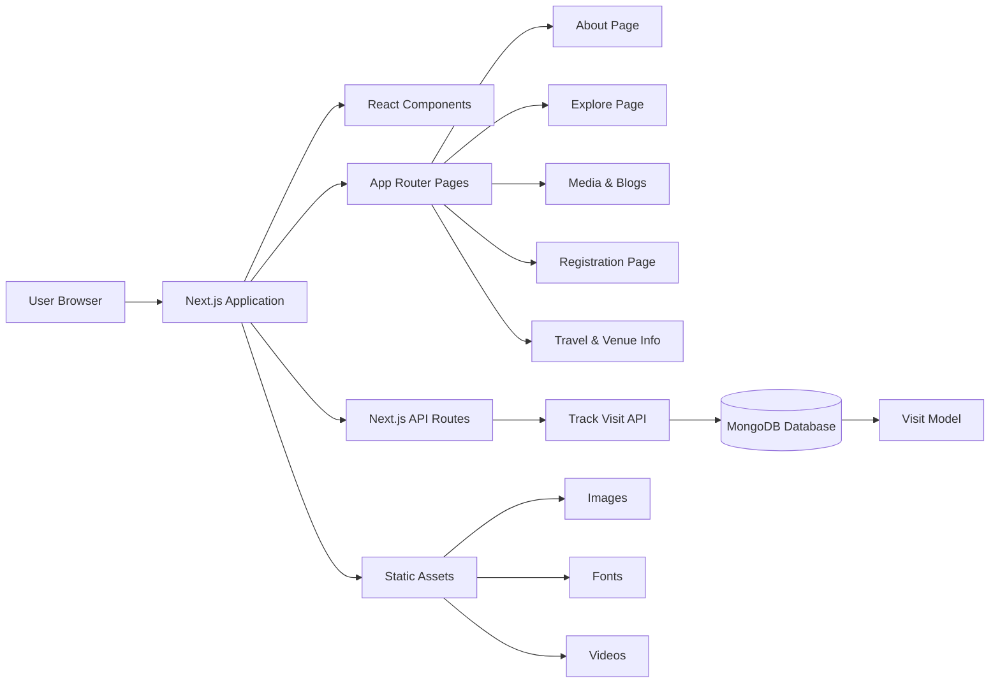

# SMRSC 2026 – Conference Platform

SMRSC (SSI Multi-Specialty Robotic Surgery Conference) is a global conference focused on robotic and technology-driven surgery. The platform brings together surgeons, healthcare professionals, innovators, and medical leaders to exchange knowledge, demonstrate robotic procedures, and explore advancements shaping the future of connected surgical care.

This repository contains the **official web platform for SMRSC 2026**, built with **Next.js** using the App Router architecture. The platform provides information about the conference including schedules, faculty, media, venues, registration, and past events.

---

# Tech Stack

### Framework
- Next.js 16 (App Router)
- React 19

### Styling
- TailwindCSS 4
- Custom fonts and assets

### Animations & UI
- Framer Motion
- Lenis (smooth scrolling)
- tsParticles

### Icons
- Lucide React

### Backend / Data
- MongoDB
- Mongoose
- Next.js API Routes

### Tooling
- ESLint
- PostCSS
- TypeScript configuration support

---

# System Architecture Diagram

The platform follows a **Next.js full-stack architecture** where the frontend UI and backend APIs are handled within the same application using the App Router. Data persistence is handled through MongoDB, while analytics for visit tracking is managed through dedicated API routes.



---

# Installation

Clone the repository and install dependencies.

```bash
git clone <repository-url>
cd smrsc2026
npm install
```

---

# Development

Start the development server:

```bash
npm run dev
```

Application runs at:

```
http://localhost:3000
```

Next.js hot reloading is enabled during development.

---

# Available Scripts

```bash
npm run dev     # start development server
npm run build   # build production bundle
npm run start   # start production server
npm run lint    # run ESLint
```

---

# Project Architecture

The project uses **Next.js App Router** with modular route separation and reusable components.

```
app/
 ├── about/
 ├── contactus/
 ├── cookies/
 ├── explore/
 ├── faq/
 ├── home/
 ├── map/
 ├── media/
 │    ├── blog1/
 │    ├── blog2/
 │    └── blog3/
 ├── pastevents/
 ├── privacy-policy/
 ├── register/
 ├── terms-of-use/
 ├── visit/
 │    ├── hotels/
 │    ├── places/
 │    └── venue/
 ├── api/
 │    └── track-visit/
 ├── layout.js
 ├── globals.css
 └── page.js
```

---

# Components

Reusable UI components are organized by feature domain.

```
components/
 ├── about/
 ├── explore/
 ├── home/
 ├── media/
 ├── pastevent/
 ├── common/
 │    ├── Header.jsx
 │    ├── footer.jsx
 │    ├── CookieBanner.tsx
 │    ├── GlobalPreloader.jsx
 │    └── SearchModal.js
 └── ui/
      ├── CountdownTimer.jsx
      └── SpeedLogger.jsx
```

---

# Data Models

MongoDB models are defined using Mongoose.

```
models/
 └── Visit.js
```

Used for tracking website visits through the `track-visit` API route.

---

# Public Assets

Static assets are stored in the `public` directory.

```
public/
 ├── fonts/
 ├── images/
 │    ├── about/
 │    ├── faculty/
 │    ├── explore/
 │    ├── home/
 │    └── pastevent/
 ├── logos/
 ├── pdf/
 └── videos/
```

---

# Environment Variables

Create a `.env.local` file in the project root.

Example:

```
MONGODB_URI=your_mongodb_connection_string
NEXT_PUBLIC_SITE_URL=http://localhost:3000
```

---

# Production Build

Create an optimized production build:

```bash
npm run build
```

Start the production server:

```bash
npm start
```

---

# Deployment

The application can be deployed on any Node.js compatible hosting platform.

Recommended platforms:

- Vercel
- AWS
- Docker-based infrastructure
- VPS with Node.js runtime

---

# Code Quality

Run lint checks:

```bash
npm run lint
```

ESLint is configured using `eslint-config-next`.

---

# License

This repository is a private internal project for the **SSI Multi-Specialty Robotic Surgery Conference (SMRSC)**.

